# WebSSMS

**A web-based Data Studio for SQL Server.** An SSMS-style Object Explorer, T-SQL query editor and
administration tooling — running entirely in the browser, served by an ASP.NET Core Blazor Server app.

No client install, no MSI, no Windows requirement: point it at a SQL Server instance and manage it from
any browser on any OS.

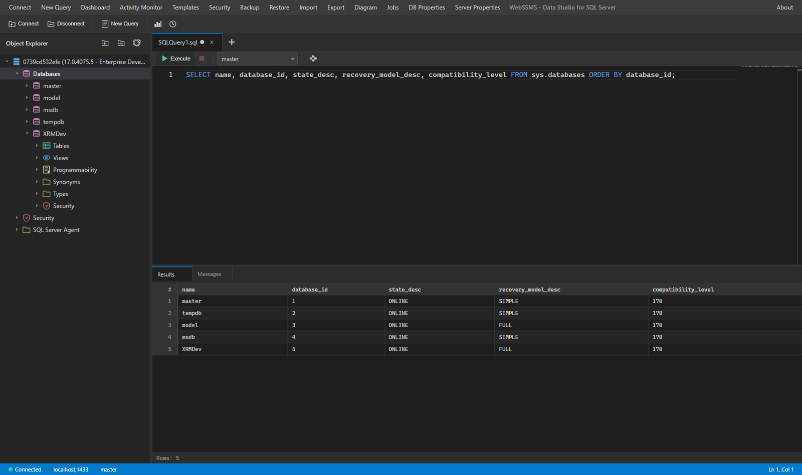

---

## Table of contents

- [Why](#why)
- [Features](#features)
- [Screenshots](#screenshots)
- [Getting started](#getting-started)
- [Backup file transfer](#backup-file-transfer)
- [Running with Docker](#running-with-docker)
- [Keyboard shortcuts](#keyboard-shortcuts)
- [Project layout](#project-layout)
- [Security notes](#security-notes)
- [Troubleshooting](#troubleshooting)
- [Contributing](#contributing)
- [License](#license)

---

## Why

SQL Server Management Studio is Windows-only and heavyweight, and Azure Data Studio has been retired.
WebSSMS aims at the everyday 80%: browse the object tree, write and run T-SQL, read the results, see what's running
on the server, script objects out, and do routine admin — from a browser tab, on a machine that never
needed a SQL client installed.

It talks to SQL Server directly over TDS via `Microsoft.Data.SqlClient`. There is no intermediate API,
no ORM, and no schema cache on disk.

---

## Features

### Object Explorer

A familiar tree over the server: **Databases**, **Security**, and **SQL Server Agent**. Each database
expands into Tables, Views, Programmability, Synonyms, Types and Security; tables expand into columns,
indexes, foreign keys, triggers and check constraints.

Right-click gets you the actions you expect:

| Node | Actions |
| --- | --- |
| Server | New Query, Refresh |
| Databases | New Database…, Refresh |
| Database | New Query, Properties…, Refresh |
| Table | Select Top 1000 Rows, Edit Top 200 Rows, Script as CREATE / DROP, Design, Refresh |
| View | Select Top 1000 Rows, Script as CREATE |
| Stored procedure | Script Procedure, Execute |
| Tables folder | New Table…, Refresh |

### Query editor

- **Monaco editor** (the VS Code editor) with T-SQL syntax highlighting, bracket colorization, folding
  and a minimap.
- **Multiple query tabs**, each with its own database selector and dirty-state indicator.
- **Execute / cancel**, row counts, execution time, and a **Messages** pane alongside **Results**.
- **Results grid** for multiple result sets.
- **Execution plan view** — operator cards with physical/logical op, object name, and relative cost bars.
- **IntelliSense** completions built from the live schema of the connected database.

### Server monitoring

- **Server Dashboard** — SQL CPU usage, memory in use, active connection count, total database size,
  server version/edition/collation/cluster state, and a per-database size + state + recovery model grid.
- **Activity Monitor** — live process list (SPID, status, login, host, database, command, CPU, disk I/O,
  blocked-by, wait type, program) with per-process **Kill**, optional 5-second auto-refresh, and a
  **Wait Statistics** tab.

### Administration

- **New Database** — SSMS-style dialog with General / Options / Filegroups pages, data and log file rows
  (logical name, file type, filegroup, initial size, autogrowth, path), owner selection, and a
  **Script** button that emits the `CREATE DATABASE` batch instead of running it.
- **Backup & Restore** — full / differential / log backups with compression, copy-only and checksum
  verification; restore with a backup-file inspector.
- **Backup file transfer** — browse the backup folder on the server, **download** a `.bak` to your
  machine, and **upload** one back to restore from it. See
  [Backup file transfer](#backup-file-transfer) for how the bytes get across.
- **Security** — Logins, database Users, server and database Roles, and an object Permissions editor.
- **SQL Server Agent** — job list with job steps.
- **Maintenance** — rebuild / reorganize indexes, update statistics, shrink database, `DBCC CHECKDB`,
  and index fragmentation reporting.
- **Table Designer** and a **Database Diagram** editor.
- **Import / Export** — CSV import wizard, and export to CSV or `INSERT` statements.
- **Properties** pages for the server and for individual databases.

### Templates

35 ready-to-edit T-SQL snippets across 11 categories (Advanced, Backup, Common Queries, Database,
Function, Index, Security, Stored Procedure, Table, Trigger, View). Click one and it opens in a new
query tab — CTEs, MERGE, PIVOT, TRY/CATCH, blocking-query diagnostics, table row counts, and the usual
CREATE/ALTER/DROP scaffolding.

---

## Screenshots

<table>
<tr>
<td width="50%">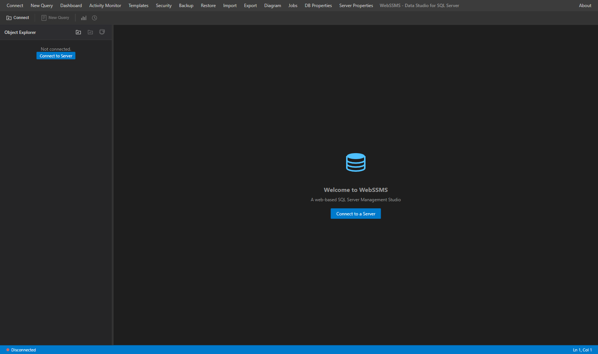<br><sub><b>Welcome</b> — dark IDE shell, disconnected</sub></td>
<td width="50%">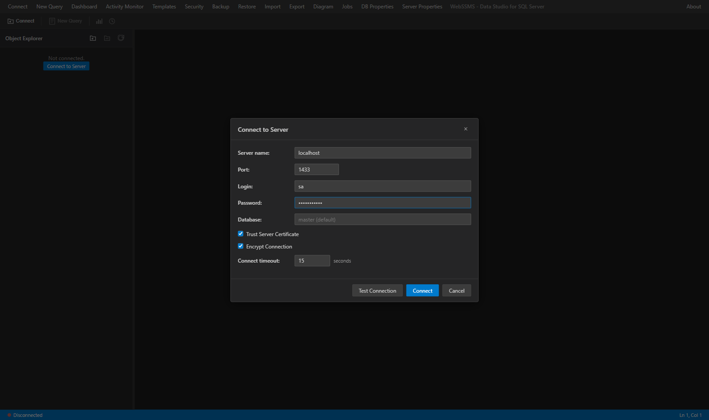<br><sub><b>Connect to Server</b> — host, port, login, encryption options</sub></td>
</tr>
<tr>
<td>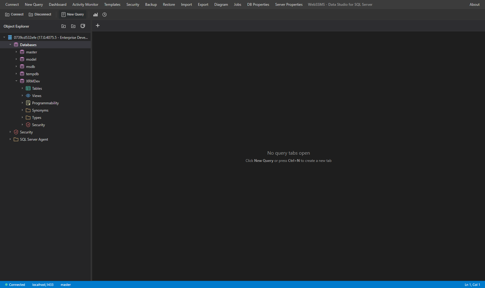<br><sub><b>Object Explorer</b> — databases, programmability, security</sub></td>
<td>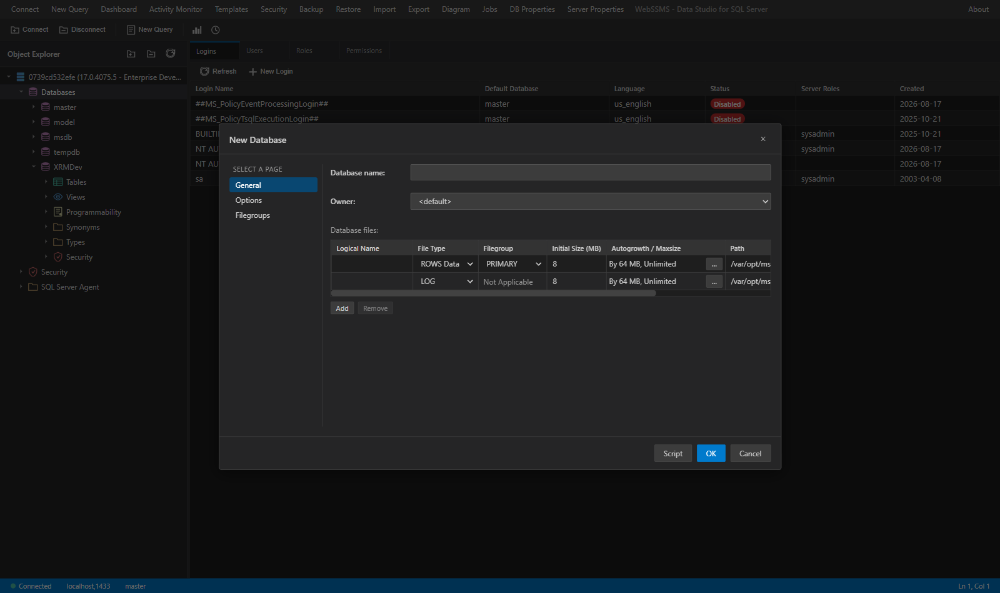<br><sub><b>New Database</b> — files, filegroups, options, Script button</sub></td>
</tr>
<tr>
<td>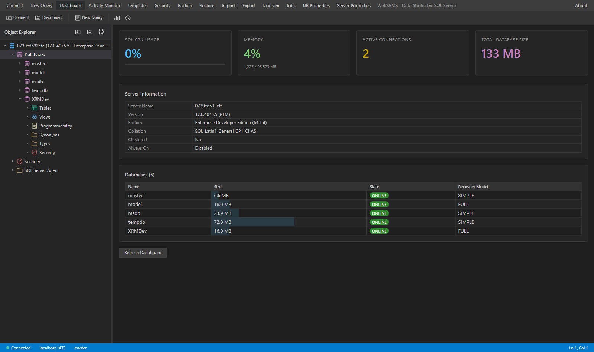<br><sub><b>Server Dashboard</b> — CPU, memory, connections, database sizes</sub></td>
<td>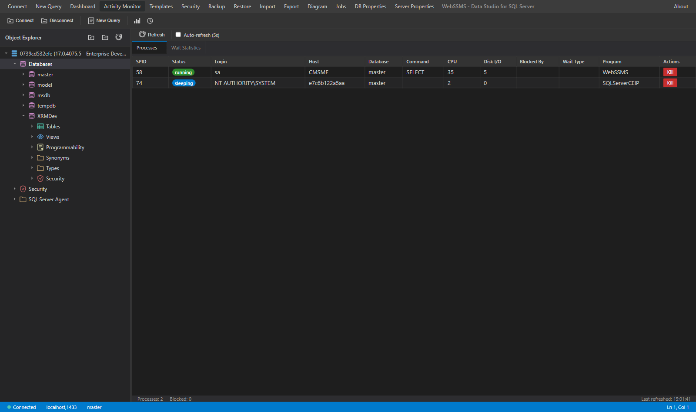<br><sub><b>Activity Monitor</b> — live processes, waits, kill</sub></td>
</tr>
<tr>
<td>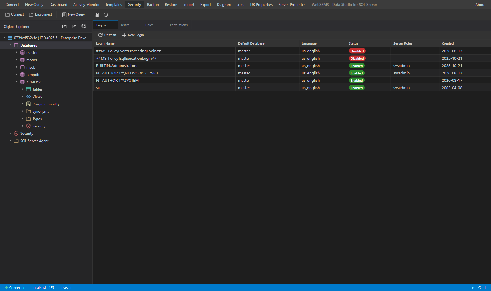<br><sub><b>Security</b> — logins, users, roles, permissions</sub></td>
<td>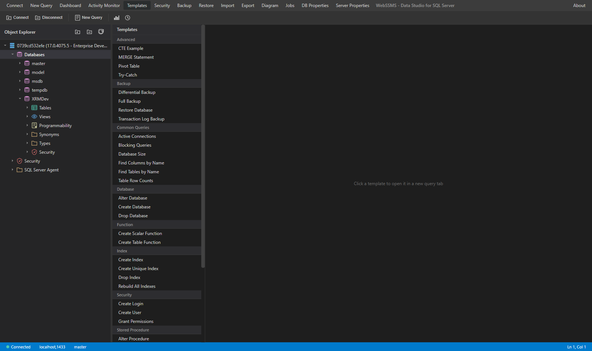<br><sub><b>Templates</b> — 35 snippets in 11 categories</sub></td>
</tr>
<tr>
<td>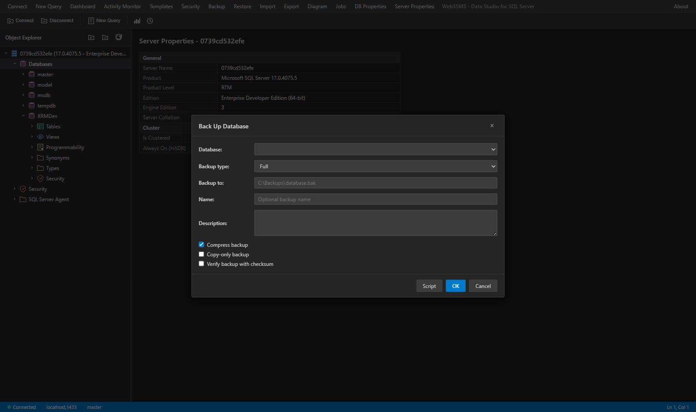<br><sub><b>Back Up Database</b> — full/diff/log, compression, checksum</sub></td>
<td>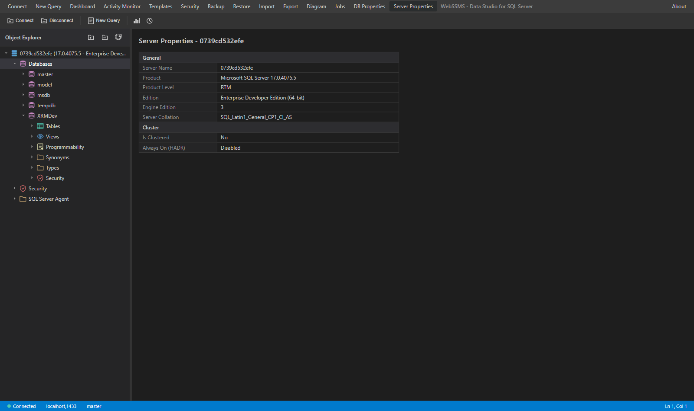<br><sub><b>Server Properties</b> — version, edition, collation, HADR</sub></td>
</tr>
</table>

---

## Getting started

### Prerequisites

- **[.NET 10 SDK](https://dotnet.microsoft.com/download)** — the project targets `net10.0`.
- **A reachable SQL Server instance.** Developed and tested against SQL Server 2025 Developer Edition
  (`mcr.microsoft.com/mssql/server:2025-latest`); `Microsoft.Data.SqlClient` supports SQL Server 2012
  and later, plus Azure SQL.
- **Outbound internet access from the browser** — the Monaco editor is loaded from cdnjs at runtime.
  Everything else is served locally.

### Run it

```bash
git clone https://github.com/cmoussalli/WebSSMS.git
cd WebSSMS
dotnet run --project WebSSMS
```

Then open <http://localhost:5199>.

`dotnet run` picks up the `http` launch profile, which sets `ASPNETCORE_ENVIRONMENT=Development` — see
[Troubleshooting](#troubleshooting) if you run it another way.

### Connect

Click **Connect** and fill in the dialog:

| Field | Notes |
| --- | --- |
| Server name | Hostname or IP. For a container on the same host, `localhost` |
| Port | `1433` by default |
| Login / Password | SQL Server authentication |
| Database | Optional; defaults to `master` |
| Trust Server Certificate | On by default — needed for self-signed dev certs |
| Encrypt Connection | On by default |
| Connect timeout | Seconds, default `15` |

**Test Connection** validates the settings without opening a session.

### Need a SQL Server to point at?

```bash
docker run -d --name mssql \
  -e ACCEPT_EULA=Y \
  -e MSSQL_SA_PASSWORD='<YourStrong!Passw0rd>' \
  -e MSSQL_PID=Developer \
  -p 1433:1433 \
  mcr.microsoft.com/mssql/server:2025-latest
```

---

## Backup file transfer

`BACKUP DATABASE ... TO DISK` writes to **SQL Server's** file system, not the web app's. So getting a
`.bak` into your browser — or a `.bak` from your browser onto a path SQL Server can restore from —
needs a transport between the two. WebSSMS picks one per file, automatically.

Open it from the **Backup Files** menu item, or from the **Download backup file** button that appears
after a backup finishes, or from **Upload backup file…** in the Restore dialog.

### The two transports

| | Reaches | Download | Upload | Size limit |
| --- | --- | --- | --- | --- |
| **File system** | Paths the web app can open itself | Yes | Yes | None |
| **Through SQL Server** | Paths only SQL Server can see | Yes | No | 2 GB |

**File system** applies when the app process can open the path directly — SQL Server on the same host,
a UNC share both machines can reach, or a volume mounted into both containers. Files stream in both
directions with no size ceiling. This is the only transport that can accept an upload.

**Through SQL Server** is the fallback when the app cannot see the path — for example the app on
Windows and SQL Server in a Linux container. Downloads are pulled over the SQL connection with
`OPENROWSET(BULK ..., SINGLE_BLOB)`; folder listings use `xp_dirtree`. This needs the
`ADMINISTER BULK OPERATIONS` permission (`sysadmin` has it), and the SQL Server service account must be
able to read the file. The 2 GB cap is the `varbinary(max)` limit, not a WebSSMS choice.

Sizes shown with a `~` came from `msdb` backup history rather than the file itself, and are slightly
short of the real file size — history records the size of the backup *data*, not of the file.

### Uploading

T-SQL can read a file off the server's disk but has no supported way to write an arbitrary one back, so
**uploads require a folder the web app itself can write to**, and that SQL Server can also read. In
practice that means one of:

- SQL Server and WebSSMS on the same host, pointed at a local folder.
- A UNC share both can reach (`\\fileserver\sqlbackups`), with the app's process identity granted write
  access and the SQL Server service account granted read access.
- One volume mounted into both containers:

  ```yaml
  services:
    sql:
      image: mcr.microsoft.com/mssql/server:2022-latest
      volumes:
        - sqlbackups:/var/opt/mssql/backup
    webssms:
      image: webssms
      volumes:
        - sqlbackups:/var/opt/mssql/backup
  volumes:
    sqlbackups:
  ```

  With the same path on both sides, `/var/opt/mssql/backup` works for downloads, uploads and restores
  alike.

If no such folder exists, WebSSMS says so rather than silently failing — downloads still work through
the SQL transport.

Uploads stream over plain HTTP (not the Blazor circuit), so Kestrel's 30 MB default request cap does
not apply and the browser shows real progress. The file is written to a `.uploading` staging file and
moved into place only once complete, so an interrupted upload cannot leave a half-written `.bak` that
looks restorable.

### Configuration

```jsonc
// appsettings.json
"BackupStorage": {
  "AllowedDirectories": [],                          // empty = any folder; see below
  "AllowedExtensions": [ ".bak", ".trn", ".dif", ".bkp" ],   // empty = these four
  "AllowSqlServerTransfer": true,                    // OPENROWSET fallback for unreachable paths
  "AllowUpload": true,
  "MaxUploadBytes": 0,                               // 0 = unlimited
  "TicketLifetimeMinutes": 30,
  "DefaultDirectory": ""                             // empty = ask SQL Server for its default
}
```

**Set `AllowedDirectories` on any shared deployment.** Left empty, transfers are allowed in any folder
so long as the file carries an allowed backup extension — convenient on a workstation, too loose
anywhere else. With roots configured, paths are normalised and checked against them, so `..` cannot
climb out. Windows and POSIX roots can be mixed; each path is matched against roots of its own style.

### How the endpoints are guarded

`/api/backup/download/{ticket}` and `/api/backup/upload/{ticket}` never accept a file path. The Blazor
circuit validates the path, mints a short-lived ticket holding the already-resolved destination, and
hands the browser only the ticket id. The endpoints resolve the ticket or return 404 — so a download
URL cannot be edited into a request for `appsettings.json`. Upload tickets are single-use; SQL
credentials stay inside the process and are never written into a ticket or a URL.

This is a guard on the transfer endpoints specifically. It does not change the fact that **the app as a
whole has no authentication** — see [Security notes](#security-notes).

---

## Running with Docker

The `Dockerfile` lives in `WebSSMS/` but expects the **repository root** as the build context:

```bash
docker build -f WebSSMS/Dockerfile -t webssms .
docker run --rm -p 8080:8080 webssms
```

Then open <http://localhost:8080>.

The image is Linux-based and listens on port 8080 as a non-root user. Remember that `localhost` inside
the container is the container itself — to reach a SQL Server running on the Docker host use
`host.docker.internal`, or put both containers on the same Docker network and connect by container name.

---

## Keyboard shortcuts

Registered inside the query editor:

| Shortcut | Action |
| --- | --- |
| `F5` or `Ctrl+Enter` | Execute the current query |
| `Ctrl+Shift+E` | Execute the selection (or the whole tab if nothing is selected) |
| `Ctrl+F5` | Parse the current query |

> `Ctrl+N` (new query) and `Ctrl+Shift+C` (connect) appear in toolbar tooltips but are not bound yet —
> there is no global key handler. Use the toolbar buttons for now.

---

## Project layout

```
WebSSMS/
├── Components/
│   ├── AgentJobs/        SQL Server Agent job list
│   ├── Backup/           Backup / restore dialogs, backup file browser, upload panel
│   ├── Connection/       Connection dialog, registered servers
│   ├── DatabaseAdmin/    New Database dialog
│   ├── DatabaseDiagram/  Diagram editor
│   ├── ImportExport/     Import / export wizards
│   ├── Layout/           App shell, reconnect modal
│   ├── Monitor/          Server dashboard, activity monitor
│   ├── ObjectExplorer/   Object tree + context menus
│   ├── Properties/       Server / database properties
│   ├── QueryEditor/      Monaco-backed editor and tab host
│   ├── Results/          Results grid, messages, execution plan
│   ├── Security/         Logins, users, roles, permissions
│   ├── Shared/           Tree view, data grid, modal, toast, tabs…
│   └── TableDesigner/    Table designer
├── Endpoints/            HTTP endpoints for backup file download / upload
├── Models/               ConnectionInfo, QueryResult, TableDefinition…
├── Services/             One service per capability (see below)
├── wwwroot/
│   ├── css/              Design tokens + component styles
│   └── js/               Monaco interop, split panels, context menu, diagram, file transfer
├── Program.cs            DI registration and pipeline
└── Dockerfile
```

Services are registered **scoped**, i.e. one instance per Blazor circuit, so each browser tab gets its
own `ConnectionManager` and its own SQL connections. `TemplateService` is the only singleton.

| Service | Responsibility |
| --- | --- |
| `ConnectionManager` | Opens, tracks, switches and disposes `SqlConnection`s |
| `QueryExecutionService` | Executes queries, non-queries and scalars; cancellation |
| `SchemaDiscoveryService` | Reads databases, objects, columns, indexes, keys, server info |
| `ScriptGeneratorService` | Scripts tables, views, procedures, functions, databases |
| `DatabaseAdminService` | Validates and builds `CREATE DATABASE` batches; collations, owners |
| `BackupRestoreService` | Backup / restore, backup file inspection, script generation |
| `BackupFileService` | Lists backup folders, validates paths, streams `.bak` downloads and uploads |
| `BackupTransferTicketStore` | Singleton handoff of transfer tickets from a circuit to the HTTP endpoints |
| `SecurityService` | Logins, database users, server and database roles, permissions |
| `MonitoringService` | Active processes and wait statistics |
| `AgentJobService` | Agent jobs and job steps |
| `MaintenanceService` | Index rebuild/reorganize, statistics, shrink, `DBCC CHECKDB` |
| `ImportExportService` | CSV import, CSV / `INSERT` export |
| `IntelliSenseService` | Schema-derived completion items, per-database cache |
| `TemplateService` | Built-in T-SQL template catalog |

---

## Security notes

Read this before putting WebSSMS anywhere other than your own machine.

- **The app has no authentication or authorization of its own.** Anyone who can reach the URL can open
  the connection dialog and attempt to connect to any SQL Server the *host* can reach, with whatever
  credentials they supply. Put it behind a reverse proxy that enforces authentication and HTTPS, bind it
  to a private network, or both — do not expose it to the internet as-is.
- **Credentials are held in server memory only**, for the life of the Blazor circuit. Nothing is written
  to disk, cookies, or browser storage, and connections are disposed when the circuit ends.
- **Queries run verbatim** against the target server with the permissions of the login used. WebSSMS
  imposes no allow-list — treat access to it as equivalent to handing out a SQL client.
- `Trust Server Certificate` defaults to **on**, which is convenient for dev containers with self-signed
  certificates but disables certificate validation. Turn it off against real servers with a trusted cert.
- **Backup transfers can read and write files on the server.** Downloads and uploads are gated by
  short-lived tickets minted server-side, and by an extension allow-list, so the endpoints cannot be
  turned into a general-purpose file reader. Still, set `BackupStorage:AllowedDirectories` to pin
  transfers to a known folder before deploying anywhere shared — see
  [Backup file transfer](#backup-file-transfer).
- Prefer a least-privilege login over `sa` for day-to-day use.

---

## Troubleshooting

**Static assets return HTTP 500 and the UI renders unstyled.**
Run the app in the Development environment. Launching the project directly without an environment set
(`dotnet run --no-launch-profile`, no `ASPNETCORE_ENVIRONMENT`) can make the fingerprinted asset
endpoints — `blazor.web.<hash>.js`, `WebSSMS.<hash>.styles.css` — throw `FileNotFoundException` for
files under `wwwroot/`. Either use the launch profile (`dotnet run --project WebSSMS`), set
`ASPNETCORE_ENVIRONMENT=Development`, or `dotnet publish` and run the published output.

**The query editor area is blank.**
Monaco is fetched from cdnjs on first use. Check the browser console for a blocked request — an offline
machine or a strict CSP/egress policy will leave the editor empty.

**Connection fails with a certificate error.**
Tick **Trust Server Certificate** (dev/self-signed), or install a certificate the client trusts.

**"New Query" opens the editor pane but no tab appears.**
Click the **+** button in the tab strip to create one.

---

## Contributing

Issues and pull requests are welcome at
[github.com/cmoussalli/WebSSMS](https://github.com/cmoussalli/WebSSMS).

```bash
dotnet build            # build
dotnet run --project WebSSMS   # run locally on :5199
```

The UI deliberately mirrors SSMS conventions — menu bar, toolbar, Object Explorer, tabbed editor, status
bar. Styling lives in `wwwroot/css/`, with design tokens in `variables.css`; prefer extending the tokens
over hard-coding colors.

---

## License

[MIT](LICENSE) © 2026 Caesar Moussalli
